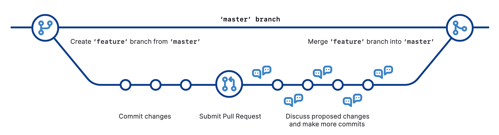

# A friendly introduction to Version Control, Git and GitHub

Before we can dive into using GitHub, we need to talk about version control and Git.

## Version control

**Version control** is a way of tracking changes to a document or collection of documents, and helps to solve one of the main challenges in working with many people on a single project. Your collaborators may be spread around the world or working in the same room; they may be working simultaneously or asynchronously. No matter how your team is organised, the work of many contributors needs to be wrangled into a single project. Version control manages this process: it stores a history of changes and who made them, allowing you to revert or go back to earlier versions of those documents, and understand how contributions by different contributors have changed the project over time. 

You may have used word processing software that has a “changes,” “history” or “revisions” feature, which also allows you to see and revisit any changes to the document (such as Microsoft Word’s [Track Changes](https://support.office.com/en-us/article/Track-changes-in-Word-197ba630-0f5f-4a8e-9a77-3712475e806a), Google Docs’ [version history](https://support.google.com/docs/answer/190843?hl=en), or LibreOffice’s [Recording and Displaying Changes](https://help.libreoffice.org/Common/Recording_and_Displaying_Changes)): this is also a form of version control. 

When we code, write text, or create any kind of content using computers, we end up with a collection of files in a folder or directory, also known as a **repository** or “repo”.


Even if you’re working independently, you’re probably going to make a lot of changes to your content or code as you go. For example, you will change some wording or functionality and leave others untouched - you will also make mistakes or change your mind while you experiment with new ideas!


As you make changes, you might make multiple copies of your files to preserve a version that's working while you try to improve it or add functionality, but keeping track of all these versions and the differences between them becomes difficult. It also seems ridiculous to have multiple nearly-identical versions of the same document. (We want to avoid [this situation](http://phdcomics.com/comics/archive.php?comicid=1531).) If you work with others, maybe you email the different versions back and forth, renaming the file each time (`code.py`, `code_rachael-comments.py`, `code-v2_rachael-comments.py`, and so on...). Whether you work alone or with others, if this situation looks familiar then you could benefit from version control. 


Version control systems start with a base version of the document and then records changes made each step of the way. Like a time machine, it can take you back to the moment your document was created, or to any other point in time when you or a collaborator saved changes to that document. With version control, you don’t save multiple copies of the document, you just save the timeline of changes of the document.


So what’s on the timeline? Each record of these changes is called a **commit**, which stores information on what changes were made, when and by whom. The timeline of the document is therefore a series of commits. Each commit should have an associated commit message, with a brief description of what changes were made and why.


When we share and work on projects with collaborators, managing the changes, or commits that multiple collaborators working in different places at different times make to a single set of documents becomes very, very important. 


And when we’re working with multiple collaborators, everybody needs to know and understand what commits are being incorporated into the repository and why, so good communication becomes very, very important. The great news is that there’s a piece of version control software to help us both manage and communicate with our collaborators about commits to our project, and that software is called **Git**.


## Git

**Git** is an open source, distributed version control system for tracking changes in text files. It was originally developed in 2005 by Linus Torvalds, the author of the Linux operating system. It is command line software which works on your local computer and this is what it looks like to a user: 

```
bash-3.2$ git --help
usage: git [--version] [--help] [-C <path>] [-c <name>=<value>]
           [--exec-path[=<path>]] [--html-path] [--man-path] [--info-path]
           [-p | --paginate | -P | --no-pager] [--no-replace-objects] [--bare]
           [--git-dir=<path>] [--work-tree=<path>] [--namespace=<name>]
           <command> [<args>]

These are common Git commands used in various situations:

start a working area (see also: git help tutorial)
   clone     Clone a repository into a new directory
   init      Create an empty Git repository or reinitialize an existing one

work on the current change (see also: git help everyday)
   add       Add file contents to the index
   mv        Move or rename a file, a directory, or a symlink
   restore   Restore working tree files
   rm        Remove files from the working tree and from the index

examine the history and state (see also: git help revisions)
   bisect    Use binary search to find the commit that introduced a bug
   diff      Show changes between commits, commit and working tree, etc
   grep      Print lines matching a pattern
   log       Show commit logs
   show      Show various types of objects
   status    Show the working tree status

grow, mark and tweak your common history
   branch    List, create, or delete branches
   commit    Record changes to the repository
   merge     Join two or more development histories together
   rebase    Reapply commits on top of another base tip
   reset     Reset current HEAD to the specified state
   switch    Switch branches
   tag       Create, list, delete or verify a tag object signed with GPG

collaborate (see also: git help workflows)
   fetch     Download objects and refs from another repository
   pull      Fetch from and integrate with another repository or a local branch
   push      Update remote refs along with associated objects

'git help -a' and 'git help -g' list available subcommands and some
concept guides. See 'git help <command>' or 'git help <concept>'
to read about a specific subcommand or concept.
See 'git help git' for an overview of the system.
```

Prefer using a web interface to the command line? There are many offerings of Git repositories as a service, such as [GitHub](https://github.com/), [Bitbucket](https://bitbucket.org/) and [GitLab](https://about.gitlab.com/) - we are going to focus on the most widely used: **GitHub**. 


## GitHub

**GitHub** is a platform for hosting and collaborating on Git repositories, and adds a web-based social and user interface to version control. GitHub provides a structure and space for communicating about collaborative work on open projects (although you can also have private repositories too). With bit of set-up, and a good workflow, you can make your project accessible and transparent, and create a respectful and productive working environment for your collaborators.

The basic GitHub workflow (called the "[GitHub flow](https://help.github.com/en/github/collaborating-with-issues-and-pull-requests/github-flow)") is built around core Git commands, and each step has distinct benefits when implemented:

1. Create a **branch** from the **repository**.
   - A branch is a copy of a repo that is contained within the orignal repo. Branches are used to work on a project features without altering the original or base repo. 
2. Add **commits**: make changes to (such as create, edit, rename, move, or delete) files in your repository.
3. Open a **pull request** from your branch with your proposed changes to kick off a discussion.
   - A pull request is a request to add a commit or collection of commits to a repository. 
4. Discuss, review and make changes (add more commits) on your branch as needed. Your pull request will update automatically.
5. **Merge** the pull request once you are done making changes to the branch.
   - Merging is the act of incorporating new changes (commits) into a repository.



One barrier to using Git and GitHub is that it can seem difficult to learn, because a lot of the terminology will be unfamiliar to newcomers. However, once you get used to the GitHub Flow, it will transform the way that you work - and the best way to learn is to dive right in! 

## Attribution

The content in this file has been adapted from:
* Mozilla Science Lab's [Study Group Orientation](https://mozillascience.github.io/study-group-orientation/), Licensed [MPL 2.0](https://www.mozilla.org/en-US/MPL/2.0/)
* Mozilla Science Lab's [GitHub Essentials](http://joeyklee.github.io/friendly-github-intro/guides/github-essentials/#introduction), Licensed [CC BY 4.0](https://creativecommons.org/licenses/by/4.0/)
* Software Carpentry's [Version Control with Git](http://swcarpentry.github.io/git-novice/), Licensed [CC BY 4.0](https://creativecommons.org/licenses/by/4.0/)
* GitHub [Training Kit: Cheatsheets](https://github.github.com/training-kit/), Licensed [CC BY 4.0](https://creativecommons.org/licenses/by/4.0/)
